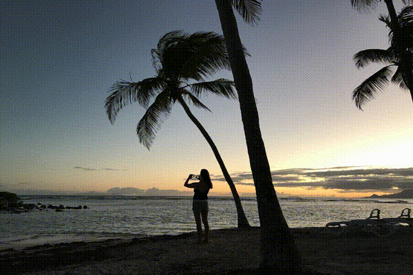

# PyDroste

Small python project to generate movies with a droste effect.

## Installation

To setup a virtual environment with python3 and the dependencies installed,
execute in a shell:

    python3 -m venv venv3
    source venv3/bin/activate
    pip install -r requirements.txt

You can now run the main script:

    python pydroste.py --input=beach.jpg \
                       --output=beach.mp4 \
                       --center=1904,1940 \
                       --scale=125

And it should create a zooming in movie:

Beside the input and output parameters, the important flags are
`center` and `scale`. `Center`` determines the point in the input picture
to zoom in on. `Scale`` is the scale of the sub-image compared to the main
image. In other words, this is how far you need to zoom in to have the
main image be replaced by the sub-image completely and which would
complete one loop.

The two other flags you can pass are `frames`, which determines how
many frames the output image will have and `fps`, which determines
how many frames per seconds the output movie will play with.

